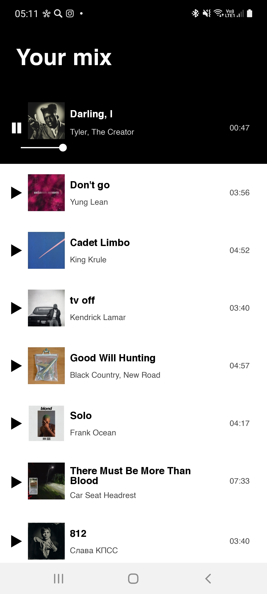
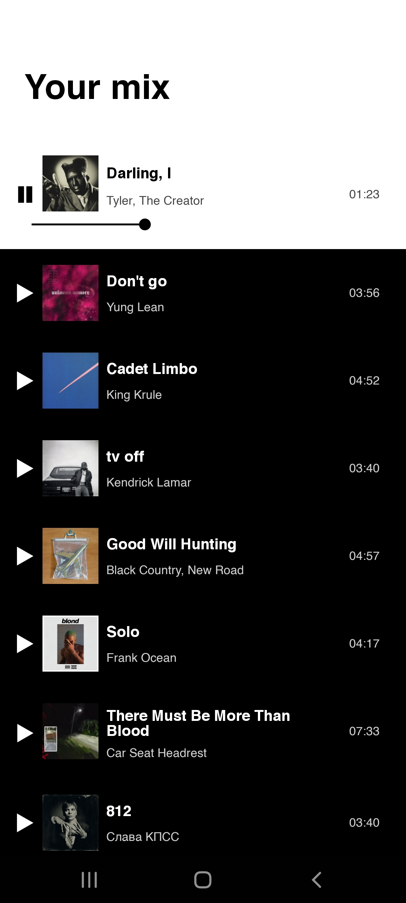

# jukebox

#### Simple application providing a list of playable songs

## Project structure

The project consists of a Golang server and an Android application. 

### Server

The server is run locally and uses a PostgreSQL database to store data. The media files - cover arts and audio files - are stored locally in `covers` and `tracks` directories and are excluded from commits for obvious reasons.

### Android application

The application implements a multi-module architecture:
* `:app` - the application module containing MainActivity
* `:song-list` - contains the implementation of the main screen providing the list of songs
* `:media-core` - encapsulates interaction with ExoPlayer for foreground playback
* `:design-core` - defines the theme of the application
* `:util` - contains utility functions and constants

Some of the technologies used:
* __Dagger 2__ for dependency injection
* __Retrofit__ for network interaction
* __Kotlin Coroutines + Flow__ for asynchronious operations
* __Androidx Lifecycle__ for lifecycle-aware asynchronious operations
* __ExoPlayer__ for media playback
* __Glide__ for image loading
* __Clean Architecture__ in modules
* __MVI architecture__ in presentation layer

## Demonstration

A gif is the best I can embed into Markdown, but there is no sound, so you will have to trust me that the music is indeed playing.

## Future improvements

The project is not finished. Some future improvements include:
* Queueing songs (currently the next song does not start playing automatically)
* Refactoring server (currently everything is in one file, pretty messy)
* Notification playback management
* Tests (currently none are written)
